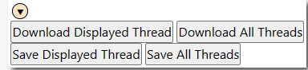
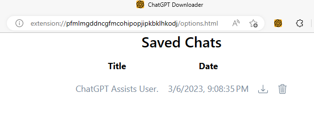
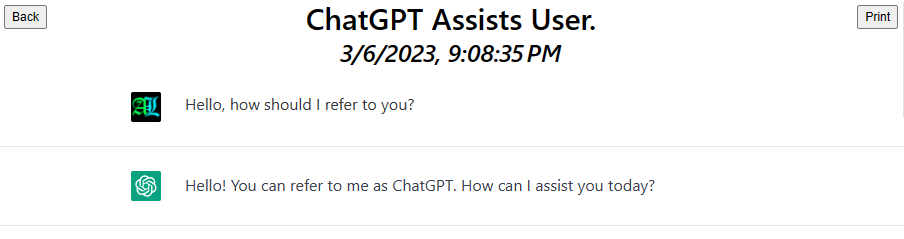

# ChatGPTDownloader
 Browser Extension to Download ChatGPT Sessions or Save for Offline use in-Browser 

&nbsp;
# Installation
You have two options:
## Download/Clone the Git Repo
This will be the fastest method for most people. Once you have downloaded and unzipped the Repository, go to your Extensions Page and select "Load Unpacked Extension". You may need to enable *Developer Mode* via a button somewhere on the page (likely bottom-left). Select the `ChatGPTDownloader` subfolder (which contains the manifest file).

The only drawback of this method is that your Browser may remind you periodically that you have Extensions running in Developer Mode.

## Download the **.crx** file from the Releases Page
Once you have the **.crx** file, you can drag-and-drop it onto your Extensions Page.

Because this Extension was not downloaded from a Store, Browsers may automatically disable it. If this happens you will have to research how to enable it on your setup. For example, by whitelisting Extensions via Registry Keys I've been able to install Extensions via **.crx** with my OS/Browser combination.

&nbsp;
# Usage
## On ChatGPT

When you visit ChatGPT (*chat.open-ai.com/chat*) you'll see that an arrow icon has been added to the top right corner of the screen. Clicking this will display a number of buttons.
### Download [...] Buttons
* Generates a JSON file and downloads it to your computer
### Save [...] Buttons
* Creates a JSON Object and stores it inside the Extension's Storage
* This version is available while you are offline and can be viewed via the Extension's Options Page (see below)
* If you uninstall the Extension, the saved object will be deleted
### [...] Displayed Thread Buttons
* Saves the conversation as it is currently displayed on the screen
### [...] All Threads Buttons
* When you edit a question on ChatGPT, it creates a new branch of the conversation (a new Thread). This will navigate through all Threads you've created and Download/Save them all.

## In Browser Usage

The Extension has an Options Page where you can find **Saved** conversations. You can get to this either by going to the *Installed Extensions* Page for your Browser, or by clicking the Extension's Icon in the Toolbar (you may or may not need to allow the Extension to access the site page via its dropdown). For ease of use, you can pin the Extension to Toolbar.

On the Options Page you will see a list of Conversations you have saved. The list provides *Download* and *Delete* icons. If you click on the Conversation's Title, you will be taken to a page where you can view the Conversation. This can be used even when you are offline.

The Conversation Page also features a Print button which will open a Print Dialog: this is a useful way to download a PDF version of the conversation.

&nbsp;
# For Developers
The `chatgpt.js` file is a standalone which provides *exports* of all the functions used by this Extension to scrape information from ChatGPT. It's also heavily documented. Feel free to fork/use the file for your own projects or read through it as a reference.

# Additional Notes
* `chat.css` is a direct lift ChatGPT's website (ambiguously named) css file; if it ever needs to be removed from the Repo you know where to get a copy.